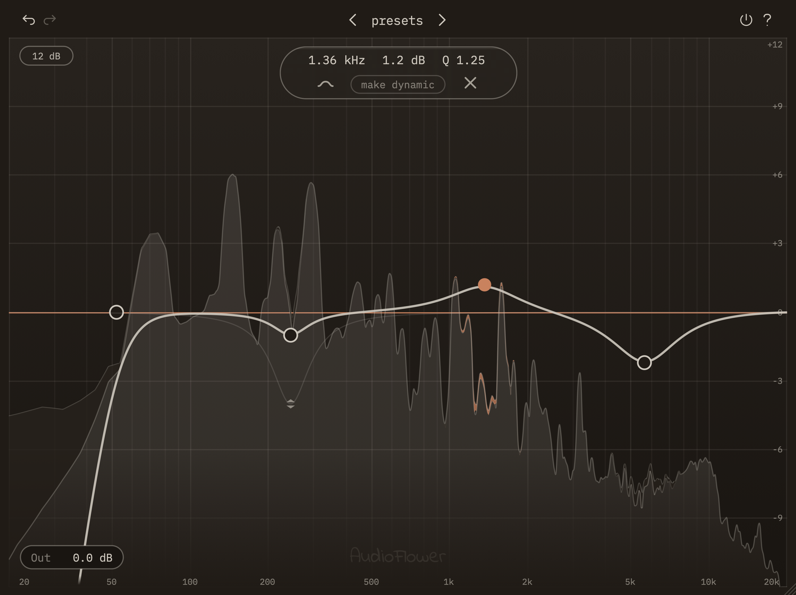

## Luke Gladfelter

Technical Production Manager at DoctorPodcasting, where we produce podcasts for
hospitals and healthcare systems across the country. Trained in audio
engineering and music production. I build audio plugins under the name
**[AudioFlower](https://audioflower.art)**.

### What I'm building

**EQ** — a six-band parametric equalizer for macOS (AU/VST3) with per-band
dynamic EQ, live spectrum analysis, and an interface where every control lives
on the frequency graph instead of a separate panel.

The parts I'm proudest of aren't features, they're the decisions. Gain caps at
±18 dB because a band pushed harder than that is the wrong tool. The dynamic EQ
has no threshold control because it works out its own, and asking for one more
number before you hear anything is a tax. An ambient background, an output
meter, a skin system, and two other features got built and then deleted for
making the plugin worse to use.

**→ [audioflower.art](https://audioflower.art)** — the site is going up now.

### How I work

I use AI-assisted development to build software, and I direct it the way I'd
direct a session: I make the product, interface, and sound decisions, and judge
every result by ear in a DAW on real material. The tooling writes code faster
than I could. It has no idea whether a compressor feels right on a vocal.

### Elsewhere

Most of my work lives at [audioflower.art](https://audioflower.art) rather than
here — the plugins are commercial, so their source stays closed.
